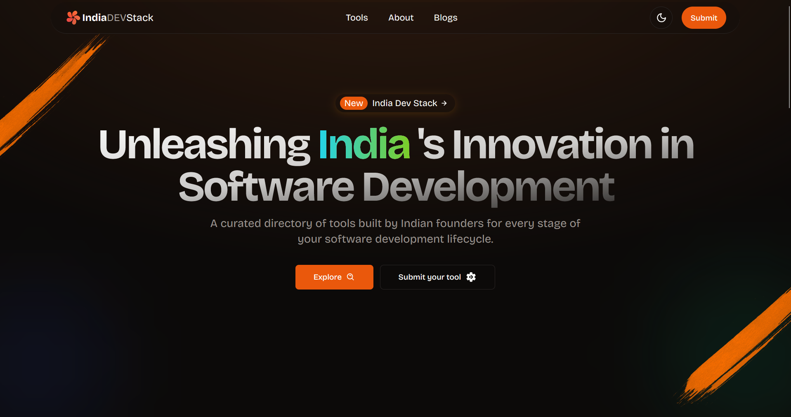

# India Dev Stack

[India Dev Stack](https://india-dev-stack.com/?utm_source=github) is a curated directory of software development tools created by Indian founders. This platform showcases and supports the incredible innovation emerging from Indian developers in the dev tools space.



## Features

- Curated collection of dev-tools and technologies from India
- Categorized software listings
- Detailed software pages with features, pricing, and maker information
- Search and filter functionality
- Responsive design for various devices
- Dark mode support

## How to submit your software

We welcome contributions to [India Dev Stack](https://india-dev-stack.com/?utm_source=github)! If you'd like to add a new software tool, please follow these steps:

1. Fork this repository
2. Create a new YAML for your software in `/src/content/software/` with all the details. Ensure that you add right category, tags, description, demo link, top features, etc. The name of the file will be the slug in the URL.
3. Add a logo (`/public/logos`) and thumbnails (`/public/thumbnails`) directory.
4. Submit a pull request

For more details, please refer to our [Contribution Guidelines](CONTRIBUTING.md).

## Submission Criteria

- At least one founder must be Indian or have a substantial presence or development center in India.
- The tool must be dedicated to software development and testing, enhancing any stage of the SDLC, and boosting team productivity and effectiveness.

#### Good Examples:

- IDEs or Code Editors
- Testing tools
- Tools that enhance software development productivity
- Project management tools for software teams
- Tools for measuring software team productivity

#### Bad Examples:

- API products focused solely on integration
- Tools whose ideal customer profiles are not CTOs, Engineering Managers, Developers, or QA personnel

## Technologies Used

- 🔥[Astro](https://astro.build/) - Static Site Generator
- 🔵[React](https://reactjs.org/) - For interactive components
- 🍃[Tailwind CSS](https://tailwindcss.com/) - For styling
- 🛡️[TypeScript](https://www.typescriptlang.org/) - For type-safe JavaScript
- 😉[Iconify Icons](https://iconify.design/) - For icons
- 🖼️[Embla Carousel](https://www.embla-carousel.com/) - For carousels

## Getting Started

1. Fork & Clone the repository:

   ```
   git clone https://github.com/your-username/india-dev-stack.git
   ```

2. Install dependencies:

   ```
   npm install
   ```

3. Run the development server:

   ```
   npm run dev
   ```

4. Open your browser and visit `http://localhost:4321`

## Project Structure

#### Static Content

- `public`:
  - `/public/blog-assets`: Pics for blog posts
  - `/public/logos`: Logos of the company
  - `/public/thumbnails`: Upload thumbnails for software entries.

#### Dynamic Content

- `src/`:
  - `content/software/`: Software entries in .yaml format. One file, one entry.
  - `content/blogs/`: You are invited to write new content for fellow founders.

